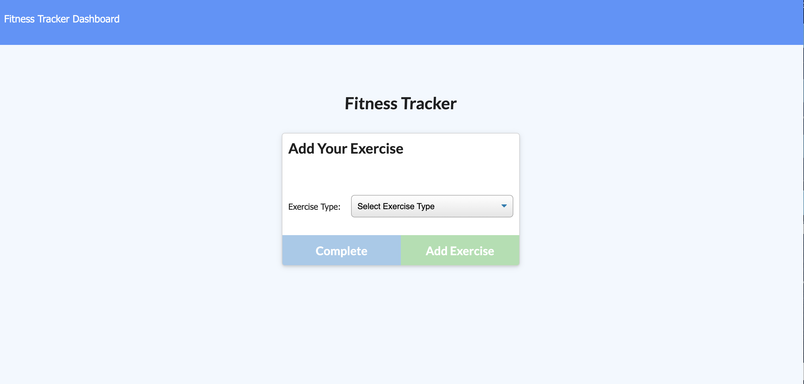

# Workout_Diary

An application that uses express, mongoose, and morgan to help you keep inventory and track your workout.
## Table of Contents

- [Locations](#locations)
- [Application Summary](#application-summary)
- [Usage Instructions](#usage-instructions)
- [Credits](#Credits)
- [License](#license)
## Locations

Deployed Application Link: []

GitHub Repository Link: https://github.com/LauraGwendolynBurch/Workout_Diary

## Application Summary

In it's current Minimal Viable Product iteration, this is a moongoose database application which allows a user to add their workouts to a centralized inventory. In this inventory, a user can track their exercises, as well as details regarding weight used/duration/reps, and then choose which workouts are completed.  

## Usage Instructions

Create workout

1. Click the '[Deployed Application Link]()' provided in the '[Location](#location)' section.
2. Click 'create worrkout'.
3. Enter the iinformation in the promps.
4. Hit complete when finished.

Contine workout 

1. Add an exercise to an exhisting workout 
2. Click the 'contine workout' button 
3. Fill in all information fields and click 'add exercise' to add it to your workout.
5. To complete a workout click the 'complete' button.

## Credits

Anna Conover (tutor)

University of Washington Bootcamp TAs and Instructor

Study Group: Aaron Parnell, Keenan Reed, Sally Perez, Rattanak Leng
## License

   

    Copyright (C) 2021  Laura Gwendolyn Burch

    This program is free software: you can redistribute it and/or modify
    it under the terms of the GNU General Public License as published by
    the Free Software Foundation, either version 3 of the License, or
    (at your option) any later version.

    This program is distributed in the hope that it will be useful,
    but WITHOUT ANY WARRANTY; without even the implied warranty of
    MERCHANTABILITY or FITNESS FOR A PARTICULAR PURPOSE.  See the
    GNU General Public License for more details.

    You should have received a copy of the GNU General Public License
    along with this program.  If not, see <https://www.gnu.org/licenses/>.